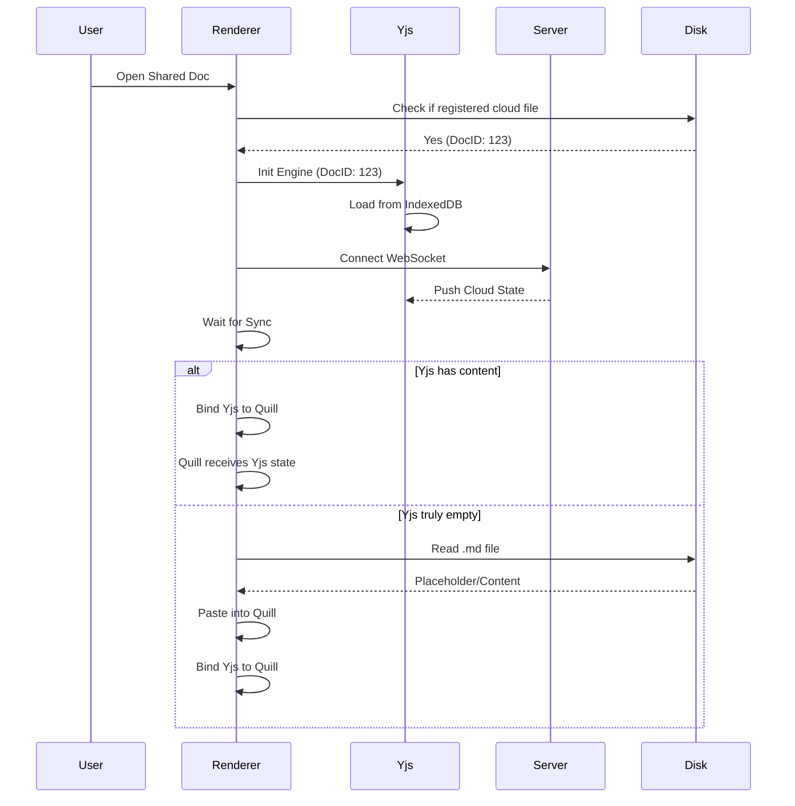

### 1. Refactor Document Loading Sequence

Modify `src/renderer/src/main.js` to eliminate the fragile 2-second heuristic.

- **Prioritize Yjs State**: For any document with a `docId` (Cloud or Local Scratchpad), the `Y.Doc` state (from IndexedDB or Cloud) must be the primary source of truth.
- **Synchronous Initial Content**: Before establishing `QuillBinding`, check if Yjs has content. If it does, let Yjs populate Quill.
- **Disk Fallback Guard**: Only load from the `.md` file on disk if:
  1. The document is NOT a cloud-synced document (i.e., a standard local file).
  2. OR the `Y.Doc` is verified empty AND the server sync has completed/timed out.
- **Refactor `setupDocument**`: 
  - Wait properly for `docEngine.whenSynced()`.
  - Implement a `isCloudDoc` flag to skip disk loading for shared files.

### 2. Harden `SharedFileManager`

Update `src/renderer/src/shared-file-manager.js`.

- **Placeholder Tagging**: When creating a placeholder file for a shared document, don't just write an empty string. Write a specific marker or ensure the file system registration is checked before reading.
- **Registration Integrity**: Ensure `fs:registerCloudFile` is reliable and that `main.js` uses it to determine if a path is a cloud-linked file.

### 3. Safety in Markdown Upgrade

Modify `src/renderer/src/main.js`.

- **Non-Destructive Upgrade**: Instead of `delete(0, length)` and `paste`, use a more cautious approach to merging markdown updates to avoid wiping the entire shared document on other clients.

### 4. Backend Compaction Reliability

Update `backend/src/yjs-handler.js`.

- **Atomic Compaction**: Ensure the merged snapshot is created *before* or *simultaneously* with the deletion of old updates. Use a Prisma transaction correctly to avoid data loss if the process is interrupted.

### 5. Rename and Save hardening

Modify `src/renderer/src/main.js`.

- **Atomic Rename**: Ensure the metadata update and local file rename are synchronized to prevent "file not found" errors during sync.
- **Save Throttle**: Ensure `saveCurrentFile` doesn't write empty content to disk if the editor hasn't fully loaded yet.

