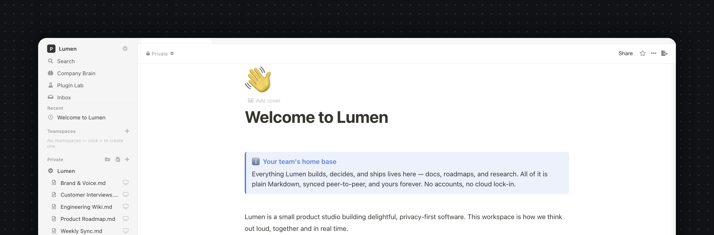
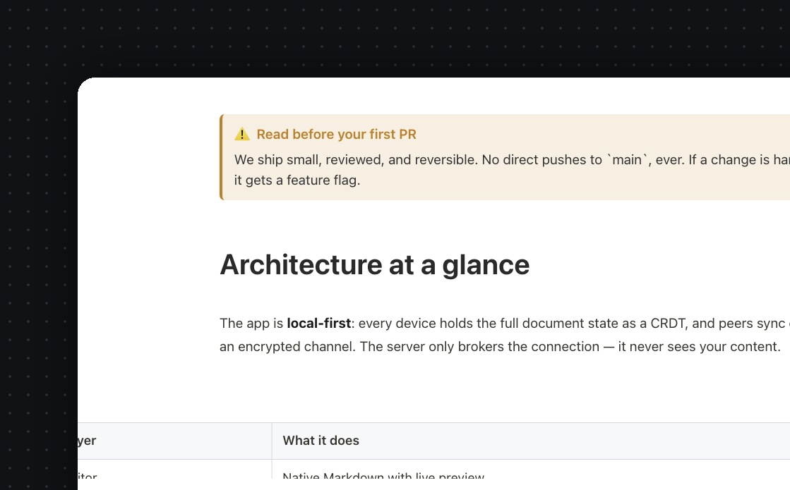
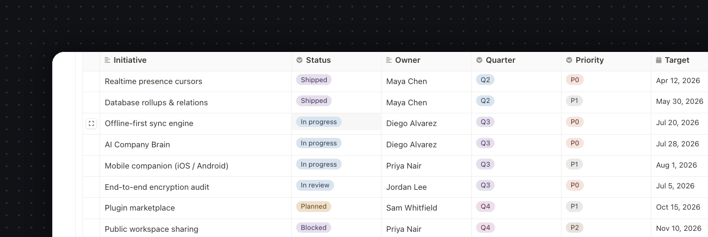
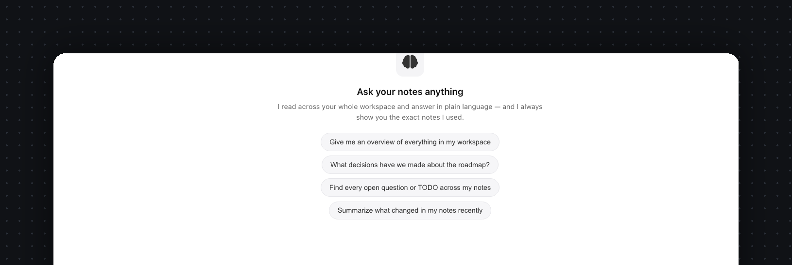
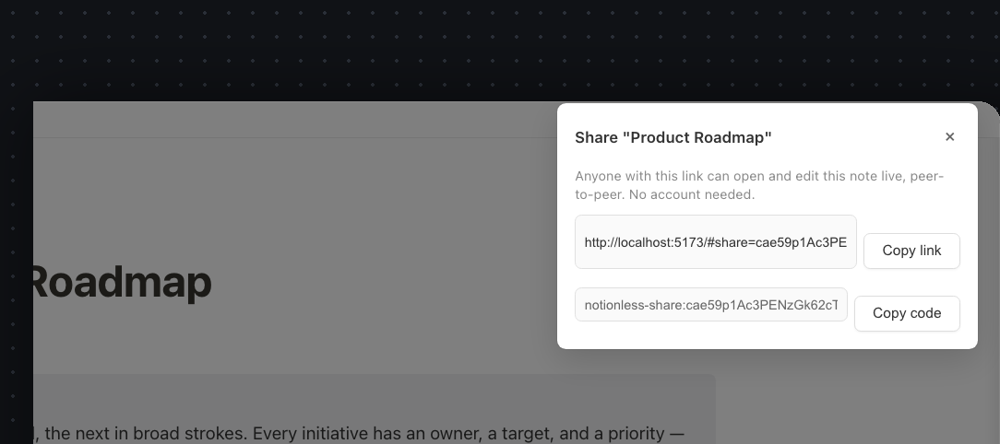

<h1 align="center">Paperus</h1>

<p align="center">
  <b>Open-source, local-first, zero-account, pure-P2P Notion alternative.</b><br>
  End-to-end encrypted Markdown notes that sync peer-to-peer — no cloud, no lock-in, no login.
</p>

<p align="center">
  <a href="LICENSE"></a>
  
  <a href="apps/mobile-native/README.md"></a>
  <a href="docs/SELF_HOSTING.md"></a>
  
</p>

<p align="center">
  
</p>

---

## What it is

Paperus is a Notion alternative that runs as a **macOS desktop app**. Your notes
are **plain Markdown files on disk** — you own them. There are **no accounts and no
login**: install the app, create a team, and share **one link**. Teammates join
instantly and edits sync **peer-to-peer over WebRTC**, end-to-end encrypted. The
only thing hosted is a tiny **stateless signaling relay** that brokers connections
and stores nothing.

- 🔒 **End-to-end encrypted** (libsodium AEAD) — the relay and peers see only ciphertext.
- 🪪 **Zero account** — identity is a deterministic keypair derived from a per-team username + password; the private key never leaves your device.
- 🛰️ **Pure P2P** — Yjs CRDTs over WebRTC; works offline, converges on reconnect.
- 📝 **Native Markdown editor** — CodeMirror 6 with live-preview decorations, not a proprietary block model.
- 🧠 **AI you control** — local Ollama, your own API key, or Claude Code. Retrieval runs offline.
- 🏠 **Self-hostable in one command** — run the whole web app + relay on your own domain. [Jump to self-hosting ↓](#self-hosting-run-it-on-your-own-domain)
- 🆓 **Free & open source** — AGPL-3.0.

## Screenshots

<table>
  <tr>
    <td width="50%"><br><sub><b>Native Markdown editor</b> — live preview, callouts, tables, math, Mermaid.</sub></td>
    <td width="50%"><br><sub><b>Databases</b> — table / list / gallery / calendar / timeline, formulas, charts.</sub></td>
  </tr>
  <tr>
    <td width="50%"><br><sub><b>Company Brain</b> — ask questions across your notes; retrieval runs offline.</sub></td>
    <td width="50%"><br><sub><b>One-link teams</b> — share a workspace or a single note, least-privilege.</sub></td>
  </tr>
</table>

## Features

Editor (CodeMirror 6, native Markdown): live preview, callouts, toggles, columns,
tables, math (KaTeX), Mermaid diagrams, images, embeds/bookmarks, code blocks,
@mentions, synced/transcluded blocks, inline comments, table of contents.

Workspace: nested pages, bi-directional wiki links & backlinks, full-text search,
templates, favorites/recents, trash & restore, multi-tab, databases (table / list /
gallery / calendar / timeline views, formulas, charts), import/export (Markdown /
HTML / PDF).

Collaboration: real-time multiplayer, live cursors/presence, version history,
teamspaces, per-note least-privilege sharing, **Company Brain** (RAG Q&A over your
notes — offline TF-IDF plus optional LLM generation).

See **[docs/STANDALONE_ARCHITECTURE.md](docs/STANDALONE_ARCHITECTURE.md)** for the
full architecture and **[docs/PLUGIN_SYSTEM.md](docs/PLUGIN_SYSTEM.md)** for the
plugin/integration surface.

## Quick start (development)

```bash
pnpm install
pnpm run dev          # Electron app (renderer + main)
pnpm run dev:m        # app + signaling relay together
```

Build & package:

```bash
pnpm run build        # electron-vite build
pnpm run dist         # build + electron-builder (installers)
```

The signaling relay lives in [`backend/`](backend/) and runs in stateless
relay-only mode (no database):

```bash
cd backend && pnpm run start
```

> A web build (`src/renderer/web/`) also exists — historically a dev-only second
> peer for sync testing, it's now a first-class **self-host** surface (see below).

## Mobile companion (iOS / Android)

A native iOS/Android **companion** lives in
[`apps/mobile-native/`](apps/mobile-native/). It pairs to a desktop team with one
link (or a QR scan), then reads and edits your notes on the same end-to-end
encrypted P2P swarm — no accounts, no server holding your data. The phone derives
the team keys locally and syncs peer-to-peer, exactly like a second desktop.

It's a native build (libsodium, WebRTC, and camera are native modules, so Expo Go
won't run it). Build the dev client once, then iterate over Metro:

```bash
cd apps/mobile-native
npm install
npm run ios          # or: npm run android
```

Full **build, run, and pairing/connect** instructions — including the relay-matching
rule that lets phone and desktop find each other — are in
**[apps/mobile-native/README.md](apps/mobile-native/README.md)**.

## How it works (in one paragraph)

Each note is a Yjs CRDT document. Identity, team membership, and per-note access are
**all client-side** and synced over the same P2P channel — there is no server-side
user database. One secret (the team link) is the entire access boundary; every other
key is derived from it via domain-separated hashes, so the relay only ever sees
hashed topics and ciphertext. A signed, append-only roster CRDT establishes
membership (first-claim-wins, signature-verified). When a note is encrypted, a
transport document carries only AEAD ciphertext over the wire while the plaintext
stays local.

## Self-hosting (run it on your own domain)

### Two ways to run it

| | **Free — nothing to host** | **Self-hosted — your own online Notion** |
|---|---|---|
| **What** | Desktop + mobile apps, syncing **directly peer-to-peer** | A **Notion-style web app on your own box**, open from any browser anywhere |
| **The server** | Naridon's **free global relay** (`oss.naridon.com`) just helps peers find each other — **stores nothing, not even your docs** | **Your** box stores every note **encrypted, available 24/7**, with always-on realtime collab — synced across web + desktop + mobile |
| **Setup** | Install the app. That's it. | One command: `docker compose -f docker-compose.selfhost.yml up -d` |
| **Availability** | Syncs when ≥1 of your devices/teammates is online | 24/7 — the box is always awake |
| **Who holds data** | Nobody but you (no server copy) | **You** — on your own hardware, ciphertext only. *We host nothing.* |

It's **one switch**: `NL_MODE=online` (default — the full online app) or `NL_MODE=p2p`
(a pure relay that stores nothing). Same notes, same end-to-end encryption either way —
the box never sees a key or a word of plaintext. The rest of this section is the
full-online setup.

You never *need* a server — the desktop app is pure P2P. But you can run **the whole
thing yourself**: the **web app** (so teammates use it in a browser, nothing to
install) *and* the **relay**, on your own domain like `docs.yourcompany.com`. There
are exactly two pieces, and you can host each one wherever you like:

<p align="center">
  
</p>

| Piece | What it is | Needs | Host it on |
|---|---|---|---|
| **Web app** | Static HTML/JS/CSS bundle — the UI | A static file host | Docker · **Vercel** · **Netlify** · **Cloudflare Pages** · GitHub Pages |
| **Relay** | Tiny WebSocket service (signaling + optional encrypted sync) | A long-running process | Docker · **Fly.io** · **Railway** · **Render** · any VPS |

> **Why the split?** The web app is just static files, so it deploys to any CDN. The
> relay keeps a WebSocket open, so it needs a host that runs persistent processes —
> serverless platforms like Vercel/Netlify **can't** run the relay. Easiest path:
> one Docker Compose box does **both** with automatic HTTPS. Or split them (static
> web on Vercel + relay on Fly) if you prefer.

### Option 0 — Just ask Claude (or any coding agent) 🤖

Don't want to touch a terminal? Paste this prompt into **Claude Code** (or Cursor,
or any coding agent) running on your server or laptop, and it sets everything up —
asking you for your domain along the way:

```text
Set up Paperus (https://github.com/Naridon-Inc/paperus) on this machine — a
self-hosted, end-to-end-encrypted, local-first Notion alternative. Steps:

1. Make sure Docker + Docker Compose are installed and running (install if needed).
2. Clone the repo if it isn't already here, then cd into it.
3. Copy .env.selfhost.example to .env. Ask me for my domain (e.g. docs.example.com)
   and my email, and set NL_DOMAIN and NL_TLS_EMAIL in .env. If I say I just want to
   try it locally, set NL_DOMAIN=:80 instead and skip the email.
4. Run: docker compose -f docker-compose.selfhost.yml up -d
5. Wait until the containers are healthy, curl /health to confirm, then tell me the
   exact URL to open. If I gave a real domain, remind me to point a DNS A record at
   this server's public IP and to open ports 80 and 443.
6. If I later say I want a company login, set NL_ACCOUNTS=1 in .env and restart.

Explain each step briefly as you go, and confirm with me before anything destructive.
```

It'll clone, configure, launch, and hand you a URL. Everything below is the same
flow done by hand.

### Option A — Everything in one command (Docker Compose) ✅ recommended

Web app **and** relay together, on your domain, with automatic Let's Encrypt HTTPS
(via Caddy) and **no database**:

```bash
git clone https://github.com/Naridon-Inc/paperus.git
cd paperus
cp .env.selfhost.example .env       # set NL_DOMAIN=docs.yourcompany.com
docker compose -f docker-compose.selfhost.yml up -d
```

Point a DNS **A record** at the box, open ports 80/443, and visit
`https://docs.yourcompany.com`. HTTPS is provisioned and renewed automatically; the
app and its sync share one origin, so there's nothing else to configure.

This comes up in **full online mode** by default — the box stores your encrypted
notes and serves them 24/7. To run it as a **pure peer-to-peer relay** that stores
nothing instead, set `NL_MODE=p2p` in `.env`. (Members can also flip their own client
back to P2P from inside the app — click the sync dot next to a teamspace.)

### Option B — Web app on Vercel / Netlify / Cloudflare Pages

The UI is a static bundle, so any of these deploy it in a couple of clicks. A
`vercel.json` and `netlify.toml` are already in the repo, so it's import-and-go:

[](https://app.netlify.com/start/deploy?repository=https://github.com/Naridon-Inc/paperus) &nbsp; [](https://vercel.com/new/clone?repository-url=https%3A%2F%2Fgithub.com%2FNaridon-Inc%2Fpaperus&env=VITE_SIGNALING_URL&envDescription=Your%20relay's%20wss%3A%2F%2F...%2Fsignaling%20URL%20(or%20wss%3A%2F%2Foss.naridon.com%2Fsignaling))

Build settings (already encoded in the config files):

| Platform | Build command | Output dir |
|---|---|---|
| Vercel | `pnpm run build:web` | `dist-web` |
| Netlify | `pnpm run build:web` | `dist-web` |
| Cloudflare Pages | `pnpm run build:web` | `dist-web` |

A static host can't run the relay, so set **one environment variable** to point the
app at one — your own relay (Option C) or the public one:

```
VITE_SIGNALING_URL = wss://your-relay.example.com/signaling
# …or use the free public relay:
VITE_SIGNALING_URL = wss://oss.naridon.com/signaling
```

### Option C — Relay on Fly.io / Railway / Render / a VPS

The relay is the Node service in [`backend/`](backend/). It reads `$PORT` and ships
with a `Dockerfile`, a `fly.toml`, and a `render.yaml`, so:

```bash
# Fly.io
cd backend && fly launch && fly deploy

# Render — "New → Blueprint", pick this repo (uses render.yaml)

# Railway — "New → Deploy from repo", root = backend/ (uses the Dockerfile)

# Any VPS
cd backend && npm install && RELAY_ONLY=true PORT=9008 npm start
```

Then point the web app at it with `VITE_SIGNALING_URL` (Option B), or build a
desktop app against it: `VITE_SIGNALING_URL="wss://<host>/signaling" pnpm run dist`.

### Optional: a company sign-in

By default anyone who reaches the page can use it (notes are still E2EE and need a
team link + password to read). To gate the instance to your team, set `NL_ACCOUNTS=1`
— the first account becomes admin.

> **The honest constraint:** a server account is an **access gate, not a key**.
> Because notes are end-to-end encrypted, **no server account can ever decrypt your
> content** — the key is derived on your device from the *team* password and never
> reaches the box.

**Full walkthrough — custom domains, accounts, always-on encrypted sync, every
setting, and per-platform steps — in [docs/SELF_HOSTING.md](docs/SELF_HOSTING.md).**
Just want 24/7 sync with no web app? See
[docs/SELF_HOSTED_SYNC.md](docs/SELF_HOSTED_SYNC.md).

## Plugins

Paperus is designed to be extended without forking — custom blocks, slash
commands, sidebar panels, AI providers, and import/export formats — through a
**sandboxed, capability-scoped** plugin API. You can even **describe a plugin to
Claude** and have it scaffolded and hot-loaded in-app. See
[docs/PLUGIN_SYSTEM.md](docs/PLUGIN_SYSTEM.md).

## Honest tradeoffs

- Anyone with the team link can read the roster and brute-force a member's password
  offline (mitigated by Argon2id + a strength meter + optional join secret).
- No revocation / forward secrecy — removing a member means rotating the team key
  (i.e. a new team).
- Availability needs **≥1 member online** by default — or run a self-hosted
  always-on box that holds an encrypted replica (see [self-hosting](#self-hosting-run-it-on-your-own-domain)).
- Presence labels are unsigned; the signed roster is the source of truth for membership.

## Contributing

Contributions are welcome under the **Developer Certificate of Origin** — sign off
your commits with `git commit -s`. By contributing you agree your work is licensed
under the project's AGPL-3.0 (Naridon Inc. retains the option to offer a commercial
dual-license). See **[CONTRIBUTING.md](CONTRIBUTING.md)** for the dev setup,
project layout, and PR checklist, and **[CODE_OF_CONDUCT.md](CODE_OF_CONDUCT.md)**
for community expectations.

## Security

Found a vulnerability? Please **don't** open a public issue — follow the private
disclosure process in **[SECURITY.md](SECURITY.md)**. The full threat model and
honest tradeoffs are documented in **[docs/SECURITY.md](docs/SECURITY.md)**.

## License

[AGPL-3.0](LICENSE) © Naridon Inc. Plugins built against the documented plugin API
are independent works and may be licensed separately — see
[docs/PLUGIN_SYSTEM.md §11](docs/PLUGIN_SYSTEM.md).
