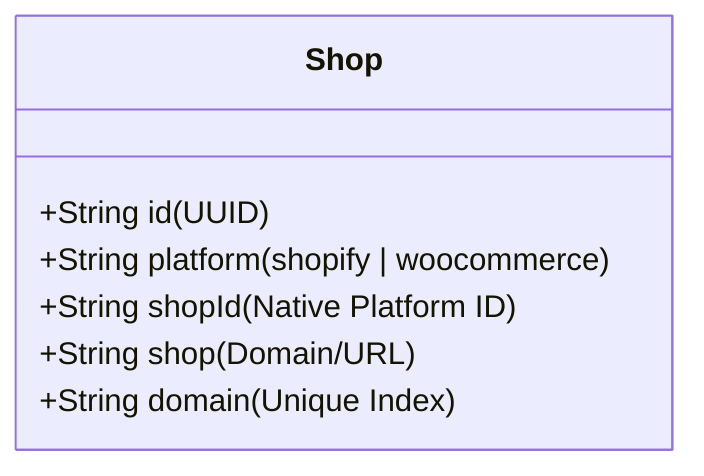

# Architecture Diagram & Overview

This document visualizes the high-level architecture of the Post-Purchase Email App, designed for multi-platform support (Shopify & WooCommerce) using a Clean Architecture / DDD approach.

## High-Level System Overview

```mermaid
graph TD
    subgraph Frontend [Frontend Monorepo]
        ShopifyApp[apps/shopify (Remix)]
        StandaloneApp[apps/standalone (Remix)]
        UIKit[packages/ui-kit (React/Polaris/Tailwind)]
        
        ShopifyApp --> UIKit
        StandaloneApp --> UIKit
    end

    subgraph Backend [Backend Modular Monolith]
        API[api/ (Express v1)]
        Domain[domain/ (Business Logic)]
        Infra[infrastructure/ (DB, AI, Integrations)]
        Workers[workers/ (Background Jobs)]
        
        API --> Domain
        Domain --> Infra
        Workers --> Domain
    end

    subgraph Data [Persistence & AI]
        DB[(PostgreSQL / Prisma)]
        AI_LLM[LLM Provider (OpenAI/Gemini)]
        Queues[Redis / BullMQ]
    end

    Frontend -- REST/JSON --> API
    Infra -- SQL --> DB
    Infra -- API Call --> AI_LLM
    Workers -- Job Processing --> Queues
```

## Core Modules

### 1. Frontend Layer
- **apps/shopify**: Dedicated Remix app for Shopify App Bridge integration. Handles HMAC validation and OAuth.
- **apps/standalone**: General web application for WooCommerce users or direct login.
- **packages/ui-kit**: Shared UI library ensuring consistent look and feel across platforms.

### 2. Backend Layer
- **api/**: Entry point for HTTP requests. Routes to controllers which invoke Domain Services.
- **domain/**:
    - **Identity Context**: Manages `Shop` authentication and platform agnostic logic.
    - **Email Engine Context**: Core logic for generating and sending personalized emails.
- **infrastructure/**: Implementation of interfaces defined in Domain.
    - `db`: Prisma Client.
    - `ai`: AI Engine runners.
    - `email`: Adapters for email providers (e.g., SendGrid).
- **workers/**: Background processes for heavy lifting (e.g., generating AI content for emails asynchronously).

## Data Model Strategy: Platform Agnostic

To support multiple platforms efficiently, we utilize a **Dual-Field Strategy**.

### Shop Model (Source of Truth)


### Relationship Handling
All related models (e.g., `EmailTemplate`, `CustomerProfile`) link back to the Shop using both:
1.  **shopId**: The stable platform ID (e.g., `gid://shopify/Shop/12345`). Used for precise relations.
2.  **shop**: The human-readable domain (e.g., `store.myshopify.com`). Used for quick lookups and logging without joins.

## Request Flow: Post-Purchase Email

1.  **Trigger**: Webhook received (Shopify `orders/create` or WooCommerce equivalent).
2.  **API Layer**: Validates webhook signature.
3.  **Domain**: `OrderProcessingService` normalizes data.
4.  **Worker**: Enqueues a job `GeneratePersonalizedEmail`.
5.  **AI Engine**: Analyses order details + customer history -> Generates content.
6.  **Infrastructure**: Sends email via SMTP/API.